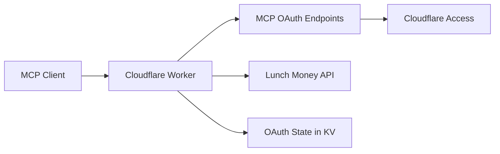

# Lunch Money MCP Starter

Remote MCP server for [Lunch Money](https://lunchmoney.app), built on Cloudflare Workers.

This repo is a practical starter for anyone who wants to expose a real MCP surface over a private API without keeping a local process running. It uses:

- Cloudflare Workers for hosting
- MCP-native OAuth endpoints on the Worker
- Cloudflare Access as the upstream identity provider
- a single Lunch Money token stored as a Worker secret
- a read-only MCP surface by default

This is not an official Lunch Money integration. It is a personal reference implementation that I cleaned up and made public because the pattern felt useful beyond my own setup.

## Why this exists

Most MCP examples are either local-only or intentionally minimal. I wanted something closer to a real deployment:

- remote, not local
- secure by default
- small enough to understand quickly
- useful enough to connect to an actual tool

Lunch Money was a good fit because the API is clean, the read surface is immediately useful, and the "private account + agent access" use case is very real.

## What it does

The Worker exposes:

- MCP tools and resources for common Lunch Money reads
- OAuth endpoints for remote MCP clients
- metadata and health routes for easier setup/debugging

Current resources:

- `lunchmoney://me`
- `lunchmoney://categories`
- `lunchmoney://categories/{id}`
- `lunchmoney://tags`
- `lunchmoney://tags/{id}`
- `lunchmoney://accounts/manual`
- `lunchmoney://manual_accounts/{id}`
- `lunchmoney://accounts/plaid`
- `lunchmoney://plaid_accounts/{id}`
- `lunchmoney://budgets/settings`
- `lunchmoney://recurring_items/{id}`
- `lunchmoney://transactions/{id}`

Current tools:

- `list_transactions`
- `get_category`
- `get_tag`
- `get_manual_account`
- `get_plaid_account`
- `get_transaction`
- `get_budget_summary`
- `list_recurring_items`
- `get_recurring_item`

## How it works

At a high level:

1. An MCP client connects to the Worker at `/mcp`.
2. The Worker exposes MCP-compatible OAuth endpoints like `/authorize`, `/token`, and `/register`.
3. Cloudflare Access handles the upstream user identity flow.
4. The Worker uses your stored Lunch Money token to fulfill read-only requests against the Lunch Money v2 API.



Supporting routes:

- `/` returns service metadata
- `/health` returns basic configuration state
- `/.well-known/oauth-authorization-server` returns OAuth metadata
- `/.well-known/oauth-protected-resource` returns protected-resource metadata

## Quick start

### Prerequisites

- Node.js 20+
- a Cloudflare account
- Wrangler configured locally
- a Lunch Money access token

### Local development

Install dependencies:

```bash
npm install
```

Create local vars:

```bash
copy .dev.vars.example .dev.vars
```

Then fill in `.dev.vars` with at least:

```env
LUNCHMONEY_ACCESS_TOKEN=replace-me
```

Run locally:

```bash
npm run dev
```

### Deploy your own copy

1. Create an OAuth KV namespace:

```bash
wrangler kv namespace create OAUTH_KV
wrangler kv namespace create OAUTH_KV --preview
```

2. Update `wrangler.jsonc`:

- add your Cloudflare `account_id`
- replace the placeholder `kv_namespaces` ids
- set `vars.PUBLIC_BASE_URL` to your deployed Worker URL

3. Configure a Cloudflare Access for SaaS OAuth application and use:

```text
https://<your-worker-host>/callback
```

as the redirect URI.

4. Add the required secrets:

```bash
npx wrangler secret put LUNCHMONEY_ACCESS_TOKEN
npx wrangler secret put ACCESS_CLIENT_ID
npx wrangler secret put ACCESS_CLIENT_SECRET
npx wrangler secret put ACCESS_TOKEN_URL
npx wrangler secret put ACCESS_AUTHORIZATION_URL
npx wrangler secret put ACCESS_JWKS_URL
npx wrangler secret put COOKIE_ENCRYPTION_KEY
```

5. Deploy:

```bash
npm run deploy
```

After deploy, point your MCP client at:

```text
https://<your-worker-host>/mcp
```

## Configuration

Non-secret values live in `wrangler.jsonc`:

- `LUNCHMONEY_API_BASE_URL`
- `CACHE_TTL_SECONDS`
- `ENABLE_WRITES`
- `PUBLIC_BASE_URL`

Required binding:

- `OAUTH_KV`

Required secrets:

- `LUNCHMONEY_ACCESS_TOKEN`
- `ACCESS_CLIENT_ID`
- `ACCESS_CLIENT_SECRET`
- `ACCESS_TOKEN_URL`
- `ACCESS_AUTHORIZATION_URL`
- `ACCESS_JWKS_URL`
- `COOKIE_ENCRYPTION_KEY`

For testing against a mock API:

```env
LUNCHMONEY_API_BASE_URL=https://mock.lunchmoney.dev/v2
```

## Verification

Run the local checks:

```bash
npm run check
```

This runs:

- `tsc --noEmit`
- `vitest`

## Notes

- Writes are intentionally disabled by default.
- The Worker includes a small in-memory TTL cache for reusable GET responses.
- The Lunch Money client retries `429` responses using `Retry-After` when available.
- Some MCP clients still need a bridge such as `mcp-remote` for remote OAuth transport.
- Clients should use the exact `/mcp` endpoint, not just the Worker origin.
